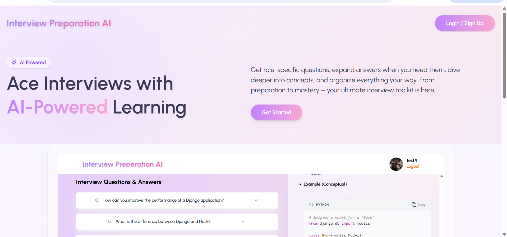
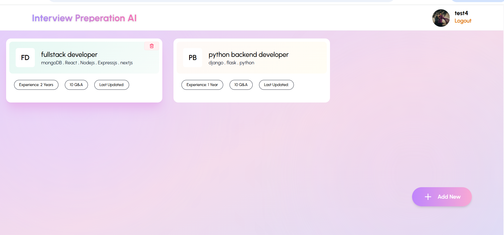
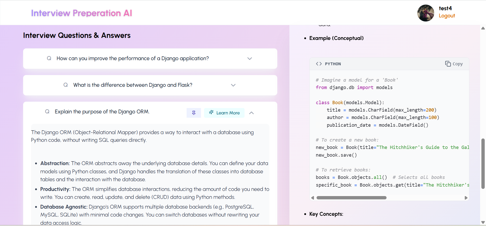

# AI-Powered Interview Preparation App  
An advanced full-stack application that helps users generate **personalized interview questions**, **AI-generated answers**, **concept explanations**, and **topic-wise study notes**. The app includes full authentication, session management, pinning features, and MongoDB persistence.

---

## 📸 Screenshots

### 🏠 Landing Page  


### 🔐 DashBoard  


### 📊 Interview Preparation  


## 🚀 Features

### 🔐 **Authentication & User Management**
- JWT-based secure login & registration  
- Profile retrieval & authentication middleware  
- Optional profile image upload  
- Password hashing using bcrypt  

### 🤖 **AI-Powered Question Generation**
- Uses **Google Gemini API** for generating:
  - Technical interview questions
  - Their answers (role + experience based)
  - On-demand concept explanations  
- Robust JSON cleanup logic to handle imperfect LLM output  
- Uses `gemini-2.0-flash-lite` model  

### 📚 **Sessions & Question Management**
- Create interview sessions by:
  - Role  
  - Experience  
  - Topics  
  - Number of questions  
- Each session stores:
  - Generated questions  
  - Answers  
  - User notes  
  - Pin/unpin state  
- Delete sessions, fetch single session, fetch all sessions  
- Add additional questions later  

### 📂 **Database (MongoDB + Mongoose)**
- User Schema  
- Session Schema  
- Question Schema  
- Auto-populate questions when fetching sessions  

### 🖥️ **Frontend (React + Tailwind)**
- Modern UI using Tailwind CSS v4  
- Axios instance + User Context  
- Login / Signup popups  
- Dashboard with all sessions  
- Accordion-based Q&A card design  
- Pinning functionality  
- “Generate Explanation” button inside each card  
- Fully responsive  

---

## 📁 **Tech Stack**

### **Frontend**
- React  
- React Router  
- Axios  
- Tailwind CSS  
- Context API  

### **Backend**
- Node.js  
- Express.js  
- MongoDB + Mongoose  
- JWT Authentication  
- bcryptjs  
- Google Gemini API  

---

## 📂 Folder Structure (Backend)

backend/ <br>
│── config/ <br>
│ └── db.js <br>
│── controllers/ <br>
│ ├── aiController.js <br>
│ ├── authController.js <br>
│ ├── sessionController.js <br>
│ └── questionController.js <br>
│── middlewares/ <br>
│ └── authMiddleware.js <br>
│── models/ <br>
│ ├── User.js <br>
│ ├── Session.js <br>
│ └── Question.js <br>
│── routes/ <br>
│ ├── authRoutes.js <br>
│ ├── sessionRoutes.js <br>
│ └── questionRoutes.js <br>
│── uploads/ <br>
│── server.js <br>
│── .env <br>
└── package.json <br>

yaml
Copy code

---

## 🔧 Installation & Setup

### **1️⃣ Clone the repository**

```bash
git clone <repo-url>
cd project-folder
```
2️⃣ Install Backend Dependencies
```bash
cd backend
npm install
```
3️⃣ Create .env file
```env
PORT=5000
MONGO_URI=your_mongo_connection_string
JWT_SECRET=your_jwt_secret_key
GEMINI_API_KEY=your_gemini_api_key
```
4️⃣ Run Backend
```bash
npm run dev
```
# Made by 
Prakriti Gupta

